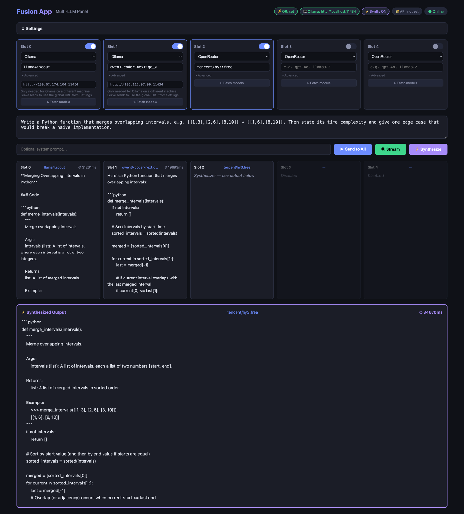
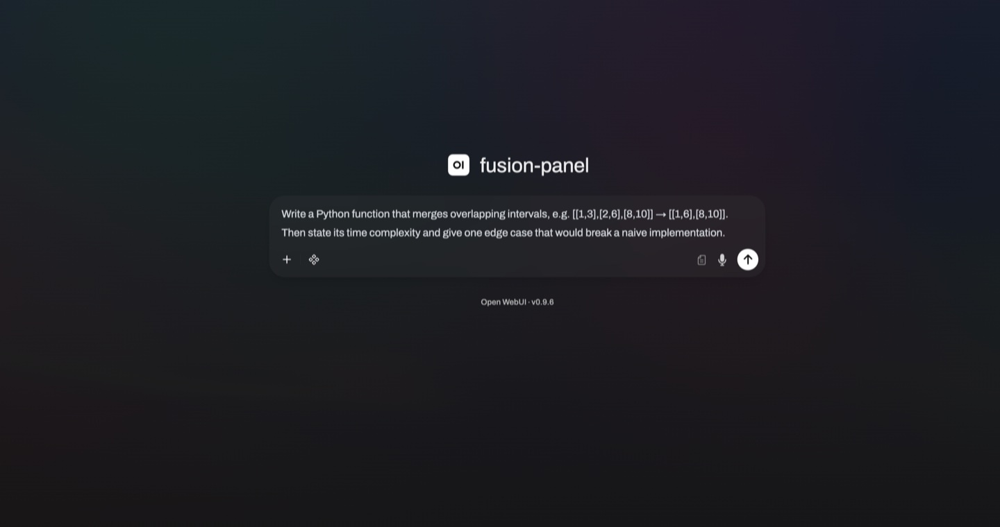
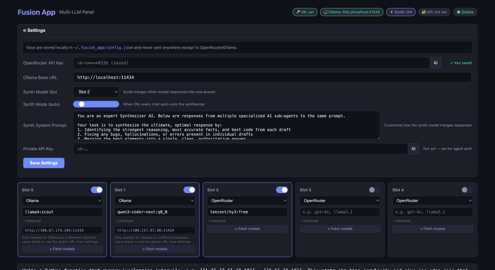

# Fusion App — Multi-LLM Panel


Run up to **5 LLMs side-by-side** — OpenRouter cloud models + Ollama local models (across as many machines as you own) — from one dashboard with a REST API. Or run your own fusion model in OpenCode, Open WebUI, or anything that takes an OpenAI-compatible endpoint.


Use it two ways:

- **Compare** — send one prompt to every model at once and read the answers side by side. Great for evaluating a new local model against ones you trust, or cloud vs. local.
- **Synthesize** — designate one slot as the **Synthesizer**: it reads all the other models' drafts and merges the best parts into a single, corrected answer (the [Mixture-of-Agents](https://arxiv.org/abs/2406.04692) pattern, self-hosted).


*Two Ollama models on different machines answer in parallel; the slot-2 synthesizer merges their drafts into the output below.*

> **Project status:** stable and feature-complete. Not actively maintained — issues and PRs may not receive timely responses.

## Quick Start

Requires **Python 3.10+**. You'll also want at least one model source: an [OpenRouter](https://openrouter.ai) API key, a local [Ollama](https://ollama.com) install, or both.

**1. Clone and install**

```bash
git clone https://github.com/RMS001/Fusion-App.git
cd Fusion-App
python3 -m venv .venv && source .venv/bin/activate
pip install -r requirements.txt
```

**2. Start the server**

```bash
python3 main.py              # default: http://127.0.0.1:8000
python3 main.py --port 8001  # pick another port if 8000 is taken
```

**3. Open the dashboard** at [http://localhost:8000](http://localhost:8000), then follow [Configuration](#configuration) to set up your model slots.

```bash
# sanity check
curl http://localhost:8000/health
```

## Features

- **5 model slots** — each independently configured with any model from OpenRouter or Ollama
- **Per-slot URL override** — point individual slots to different Ollama nodes on your network
- **OpenRouter support** — access 300+ cloud models (GPT-4o, Claude, Gemini, Llama, DeepSeek, etc.)
- **Ollama support** — run local models (Llama 3.2, Mistral, Qwen, etc.) on one or many machines
- **Parallel inference** — sends your prompt to all enabled slots simultaneously
- **Streaming (SSE)** — token-by-token streaming to the UI or API consumers
- **Synthesizer** — designate one slot as a "synth" to merge responses from all other models into a single optimal answer
- **Streaming synthesis** — the synth model's output streams token-by-token through `/v1/chat/completions`, so connected clients see tokens immediately
- **Custom synth prompt** — customize how the synthesizer merges responses via the UI or API
- **Persistent config** — API keys and slot configuration saved to `~/.fusion_app/config.json` (file is `0600`; keys never leave the machine unmasked)
- **Private API key** — one key secures **all** `/api/*` and `/v1/*` endpoints; the server refuses to bind to a non-loopback address without one (override with `--insecure`)
- **Model discovery** — fetch available models from either provider with one click
- **Dark-theme dashboard** — responsive web UI, works on desktop and mobile
- **REST API** — every feature exposed via clean HTTP endpoints for agent integration
- **OpenAI-compatible API** — use the whole panel as a single "model" from Open WebUI, OpenCode, any OpenAI SDK, or custom scripts

## Project Structure

```
fusion-app/
├── main.py                         # Entry point
├── requirements.txt                # Python dependencies
├── fusion_app/
│   ├── __init__.py
│   ├── config.py                   # Config persistence (~/.fusion_app/config.json)
│   ├── panel.py                    # Panel orchestrator (5-slot manager + synthesizer)
│   ├── api.py                      # FastAPI application (all routes)
│   ├── providers/
│   │   ├── base.py                 # Abstract LLM provider interface
│   │   ├── openrouter.py           # OpenRouter cloud API
│   │   └── ollama.py               # Ollama local API
│   └── static/
│       ├── index.html              # Dashboard UI
│       ├── style.css
│       └── app.js
├── tests/
│   ├── conftest.py                 # Shared fixtures (temp config, test client)
│   ├── test_api.py                 # API endpoint tests
│   ├── test_providers.py           # Provider parsing/contract tests (mocked HTTP)
│   └── test_streaming.py           # SSE streaming contract tests (mocked HTTP)
└── .gitignore
```

## Usage

### Web Dashboard

1. Start the server: `python3 main.py`
2. Open `http://localhost:8000` in your browser
3. (Optional) Click **Settings** to:
   - Add your OpenRouter API key
   - Change the Ollama base URL
   - Set a **Synth Model Slot** to merge other model responses into one answer
   - Toggle **Synth Mode (auto)** to automatically run the synthesizer on every chat
   - Customize the **Synth System Prompt** to control how responses are merged
   - Set a **Private API Key** to secure the `/api/*` and `/v1/*` endpoints (required before exposing the server beyond localhost)
4. Toggle slots on/off, select providers, and pick models
5. Optionally set a **URL Override** per slot to target different Ollama nodes
6. Type a prompt and click **Send to All**, **Stream**, or **⚡ Synthesize**

### REST API

The API auto-generates OpenAPI docs at `http://localhost:8000/docs`.

#### Config

```bash
# Get current config
curl http://localhost:8000/api/config

# Update config (API keys, slots, etc.)
curl -X PUT http://localhost:8000/api/config \
  -H "Content-Type: application/json" \
  -d '{
    "openrouter_key": "sk-or-v1-...",
    "ollama_base_url": "http://localhost:11434",
    "synth_mode": true,
    "synth_slot": 4,
    "slots": [
      {"provider": "ollama", "model": "qwen-coder-80b", "enabled": true, "base_url_override": "http://192.168.1.10:11434"},
      {"provider": "ollama", "model": "llama-3.3-70b",  "enabled": true, "base_url_override": "http://192.168.1.11:11434"},
      {"provider": "ollama", "model": "gpt-oss-120b",   "enabled": true, "base_url_override": "http://192.168.1.12:11434"},
      {"provider": "openrouter", "model": "",            "enabled": false},
      {"provider": "openrouter", "model": "deepseek/deepseek-v4-pro", "enabled": true}
    ]
  }'
```

#### Chat

```bash
# Send to all enabled slots
curl -X POST http://localhost:8000/api/chat \
  -H "Content-Type: application/json" \
  -d '{"prompt": "What is the capital of France?"}'

# Send to a specific slot only
curl -X POST http://localhost:8000/api/chat \
  -H "Content-Type: application/json" \
  -d '{"prompt": "Hello", "slot": 0}'

# With a system prompt
curl -X POST http://localhost:8000/api/chat \
  -H "Content-Type: application/json" \
  -d '{"prompt": "Explain quantum computing", "system_prompt": "You are a physicist."}'

# Streaming (Server-Sent Events)
curl -N -X POST http://localhost:8000/api/chat/stream \
  -H "Content-Type: application/json" \
  -d '{"prompt": "Count to 10 slowly."}'
```

#### Model Discovery

```bash
# List all OpenRouter models
curl http://localhost:8000/api/models/openrouter

# List all local Ollama models
curl http://localhost:8000/api/models/ollama

# List models on a specific Ollama node (e.g. a slot's URL override)
curl "http://localhost:8000/api/models/ollama?base_url=http://192.168.1.11:11434"
```

#### Health

```bash
curl http://localhost:8000/health
```

### Synthesizer

The synthesizer feature lets you use one model to merge the responses from all other models into a single, optimal answer.

**How to set it up:**
1. Open the dashboard at `http://localhost:8000`
2. Click **Settings** and find the **Synth Model Slot** dropdown
3. Choose which slot (0-4) will act as the synthesizer
4. Make sure that slot has a capable model configured (e.g. `deepseek/deepseek-v4-pro`, `gpt-4o`, `anthropic/claude-sonnet-4.5`)
5. Make sure at least one other slot is enabled with a model
6. Type a prompt and click the **⚡ Synthesize** button

**How it works:**
1. The prompt is sent to all **enabled non-synth** slots in parallel
2. All responses are collected and combined into a meta-prompt
3. The meta-prompt is sent to the synth model with instructions to:
   - Identify the strongest reasoning and most accurate content from each draft
   - Fix any bugs, hallucinations, or errors
   - Merge the best elements into a single, clean, definitive answer
4. The synthesized response appears in the purple **Synth Output** panel below the main responses

**Custom synth prompt:**
You can customize the synthesizer's behavior by editing the **Synth System Prompt** in settings. For example, for coding tasks:

```
You are an expert Meta-Developer. Below are proposed code solutions from specialized sub-agents.
Your task is to synthesize the ultimate, optimal code solution. Identify the most efficient logic,
fix any bugs or hallucinations, and provide the final, clean code output.
```

Or a **solve-first** variant: instead of merging the drafts, the synthesizer forms its own
answer independently and then uses the drafts only as an audit checklist. This guards against
anchoring on the drafts and against splicing conflicting approaches together:

```
You are the lead engineer producing the final answer to the user's prompt.
Before you were assigned this task, junior engineers independently
drafted candidate responses. Their drafts are provided below as advisory
input only.

Your process:
1. First, solve the problem yourself. Form your own solution and reasoning
   independently before weighing the drafts.
2. Then audit the drafts against your solution:
   - If a draft caught an edge case, bug, requirement, or better approach
     you missed, verify the claim and incorporate it.
   - If a draft conflicts with your solution, determine which is actually
     correct. Never average or splice conflicting approaches together.
   - Treat all claims in the drafts as unverified until you confirm them.
     Draft agreement is not evidence of correctness — they may share the
     same mistake.
3. If the drafts are wrong or take an inferior approach, discard them
   entirely and use your own solution.

Produce only the final, complete, authoritative answer. Write as if you
are the sole respondent: no references to drafts, junior engineers, other
models, or your review process. For code: complete and runnable, no
placeholders.
```

Note: solve-first synthesis spends more time thinking before the first output token —
the SSE heartbeats (see *Timeouts & long silent windows* below) keep the stream alive
through that window.

**API usage:**

```bash
# Synthesize all responses
curl -X POST http://localhost:8000/api/synth \
  -H "Content-Type: application/json" \
  -d '{"prompt": "Explain quantum computing"}'

# Synthesize with system prompt
curl -X POST http://localhost:8000/api/synth \
  -H "Content-Type: application/json" \
  -d '{"prompt": "Write a poem", "system_prompt": "You are a poet."}'
```

The synth endpoint returns:
```json
{
  "synth_slot": 4,
  "synth_model": "deepseek/deepseek-v4-pro",
  "responses": {
    "Slot 0 (qwen-coder-80b)": { "content": "...", "model": "...", "latency_ms": 1234 },
    "Slot 1 (llama-3.3-70b)": { "content": "...", "model": "...", "latency_ms": 5678 }
  },
  "synthesis": {
    "content": "The merged, optimal response combining the best of all drafts...",
    "model": "deepseek/deepseek-v4-pro",
    "latency_ms": 2345
  }
}
```

### Multi-Node Ollama Setup

Run different models on different machines by setting `base_url_override` per slot:

```json
{
  "slots": [
    {"provider": "ollama", "model": "qwen-coder-80b", "enabled": true, "base_url_override": "http://192.168.1.10:11434"},
    {"provider": "ollama", "model": "llama-3.3-70b",  "enabled": true, "base_url_override": "http://192.168.1.11:11434"},
    {"provider": "ollama", "model": "gpt-oss-120b",   "enabled": true, "base_url_override": "http://192.168.1.12:11434"},
    {"provider": "openrouter", "model": "",            "enabled": false},
    {"provider": "openrouter", "model": "deepseek/deepseek-v4-pro", "enabled": true}
  ]
}
```

Each slot talks to its own Ollama node independently. Slots without `base_url_override` fall back to the global `ollama_base_url`.

### Chat UI & Agent Integration (OpenAI-compatible)

Fusion App exposes an **OpenAI-compatible API** at `/v1/chat/completions` and advertises itself as a single model named **`fusion-panel`**, so any tool that speaks the OpenAI protocol can treat your whole panel as one model.

| Integration | How to Connect |
|---|---|
| **Open WebUI** | Add an OpenAI API connection pointing at Fusion (steps below) — `fusion-panel` appears in the model dropdown |
| **OpenCode / agent tools** | Point your tool to `POST /v1/chat/completions` with `model: "fusion-panel"` |
| **Any OpenAI SDK** | Set `base_url` to `http://localhost:8000/v1` and `api_key` to your private key (if set) |
| **Custom scripts** | `requests.post("http://localhost:8000/v1/chat/completions", json={"messages": [...]})` |

#### Using the panel from Open WebUI

1. If Open WebUI runs on a **different machine**, Fusion must listen beyond localhost. Set a **Private API Key** in Settings first (the server refuses non-loopback binds without one), then restart with `python3 main.py --host 0.0.0.0`.
2. In Open WebUI: **Admin Panel → Settings → Connections → OpenAI API**, add a connection:
   - **URL**: `http://<fusion-host>:8000/v1`
   - **Key**: your Fusion private API key (anything non-empty if you didn't set one)
3. Select **`fusion-panel`** in the model dropdown of any chat.



With **Synth mode ON**, every message you send from Open WebUI fans out to all enabled slots and streams back the synthesized answer (the individual drafts ride along in a `fusion_synth` metadata field). With it off, replies come from the first enabled slot only — the side-by-side view is a dashboard feature.

#### Usage

```bash
# Without auth (no private API key set)
curl http://localhost:8000/v1/chat/completions \
  -H "Content-Type: application/json" \
  -d '{"messages":[{"role":"user","content":"Hello"}]}'

# With auth header
curl http://localhost:8000/v1/chat/completions \
  -H "Content-Type: application/json" \
  -H "Authorization: Bearer sk-my-key" \
  -d '{"messages":[{"role":"user","content":"Hello"}]}'

# Streaming (works with synth mode — synth output streams token-by-token)
curl -N http://localhost:8000/v1/chat/completions \
  -H "Content-Type: application/json" \
  -d '{"messages":[{"role":"user","content":"Count to 5"}], "stream": true}'

# Multi-turn conversation (full message history is forwarded)
curl http://localhost:8000/v1/chat/completions \
  -H "Content-Type: application/json" \
  -d '{"messages":[
    {"role":"system","content":"You are a physicist."},
    {"role":"user","content":"What is gravity?"},
    {"role":"assistant","content":"Gravity is..."},
    {"role":"user","content":"Explain more about general relativity"}
  ]}'
```

**How synth mode interacts with `/v1/chat/completions`:**
- When **Synth Mode** is ON in settings, every `/v1/chat/completions` call auto-runs the synth flow
- **Streaming**: The synth model's response streams token-by-token (drafts are gathered internally first)
- **Non-streaming**: Response includes `"fusion_synth"` metadata with individual draft responses

#### Timeouts & long silent windows

In synth mode there is no synth output to stream until **every draft has finished** — with large local models that window can run to minutes (a cold model load alone can add 30–60+ seconds). Fusion keeps the connection alive through it: streaming responses emit an SSE comment heartbeat (`: heartbeat`) every 10 seconds of silence, which SSE parsers ignore, so idle timeouts in clients and reverse proxies don't drop the stream.

Recommended client/config settings for long panel runs:

- **OpenCode (and similar agent tools)** — raise the per-provider timeout in its JSON config generously (e.g. `600000` ms) for the Fusion provider. Heartbeats reset *idle* timers, but a total-request timeout still needs headroom for the full draft + synthesis run. Note these clients work for plain chat only — tool/function calling is not supported (see [Limitations & Notes](#limitations--notes)).
- **Ollama** — set `keep_alive` (e.g. `OLLAMA_KEEP_ALIVE=1h`, or per-model) so panel models stay resident between requests. Without it, a panel can pay a cold-load penalty on several slots at once.
- **Fusion `slot_timeout`** (default `300` s) — caps each draft. A draft that hits the cap doesn't fail the request; its timeout message is passed to the synthesizer in place of a draft. If your slowest slot legitimately needs longer (big model + long thinking), raise `slot_timeout` in Settings or via `PUT /api/config`.
- **Reverse proxies** — the heartbeat keeps idle-read timeouts happy, but check any hard total-response limits (e.g. Cloudflare's 100 s default applies to the *first byte*, which heartbeats satisfy).

**Response (synth mode off):**
```json
{
  "id": "fusion-chat-1234567890",
  "object": "chat.completion",
  "model": "openai/gpt-4o",
  "choices": [{"index": 0, "message": {"role": "assistant", "content": "..."}, "finish_reason": "stop"}],
  "usage": {"prompt_tokens": 0, "completion_tokens": 0, "total_tokens": 0}
}
```

**Response (synth mode on):**
```json
{
  "id": "fusion-synth-1234567890",
  "object": "chat.completion",
  "model": "deepseek/deepseek-v4-pro",
  "choices": [{"index": 0, "message": {"role": "assistant", "content": "..."}, "finish_reason": "stop"}],
  "usage": {...},
  "fusion_synth": {
    "synth_model": "deepseek/deepseek-v4-pro",
    "synth_slot": 4,
    "responses": { "Slot 0 (...)": {"content": "...", "model": "...", "error": null} }
  }
}
```

## Configuration


*Settings: global keys, the synthesizer slot and its system prompt, and per-slot URL overrides pointing at different Ollama machines.*

Config is stored at `~/.fusion_app/config.json` and auto-saved from the UI.

| Field | Default | Description |
|---|---|---|
| `openrouter_key` | `""` | OpenRouter API key (falls back to the `OPENROUTER_API_KEY` env var) |
| `ollama_base_url` | `http://localhost:11434` | Default Ollama server URL (must be an `http(s)` URL) |
| `private_api_key` | `""` | API key for authenticating `/api/*` and `/v1/*` requests (empty = open access, loopback only) |
| `synth_mode` | `false` | When true, every `/api/chat` and `/v1/chat/completions` auto-runs the synth |
| `synth_slot` | `-1` | Slot index (0-4) to use as synthesizer, or -1 to disable |
| `synth_system_prompt` | *(built-in)* | System prompt for the synthesizer model (customizable) |
| `slot_timeout` | `300` | Max seconds to wait for a single slot's non-streaming response |
| `slots[0..4].provider` | varies | `"openrouter"` or `"ollama"` |
| `slots[0..4].model` | varies | Model identifier |
| `slots[0..4].enabled` | varies | Whether this slot is active |
| `slots[0..4].base_url_override` | `null` | Override URL for this slot (e.g. a specific Ollama node IP) |

## API Endpoints

All endpoints except `/health` and the UI require `Authorization: Bearer <private_api_key>` once a private key is set. The dashboard prompts for the key on first use and remembers it in the browser.

| Method | Path | Description |
|---|---|---|
| `GET` | `/health` | Liveness check |
| `GET` | `/api/config` | Get full panel config + masked keys |
| `PUT` | `/api/config` | Update config (keys, slots, models, synth, auth) |
| `POST` | `/api/chat` | Send prompt (all slots, single slot, or auto-synth) |
| `POST` | `/api/chat/stream` | SSE streaming from all enabled slots (+ synth if enabled) |
| `POST` | `/api/synth` | Send prompt to all slots, then synth merges them |
| `GET` | `/api/models/openrouter` | List OpenRouter models |
| `GET` | `/api/models/ollama` | List Ollama models (`?base_url=` targets a specific node) |
| `GET` | `/v1/models` | OpenAI-compatible model listing (`fusion-panel`) |
| `POST` | `/v1/chat/completions` | OpenAI-compatible chat (supports streaming + synth mode) |
| `GET` | `/docs` | Interactive OpenAPI documentation |

## Security Notes

- The server binds to `127.0.0.1` by default. It **refuses** to bind to any other address (e.g. `--host 0.0.0.0`) unless a private API key is configured or `--insecure` is passed.
- When a private API key is set, **every** `/api/*` and `/v1/*` endpoint requires it as a Bearer token — including config reads/writes and chat.
- Slot `base_url_override` and `ollama_base_url` must be `http(s)` URLs. Only point slots at hosts you trust; the server forwards prompts to them and returns their responses.
- `~/.fusion_app/config.json` stores keys in plaintext and is written with `0600` permissions. A corrupt config file is backed up to `config.json.bak` instead of being silently replaced.
- On `/v1/chat/completions`, upstream provider failures return an OpenAI-style error object with HTTP 502 (not a 200 with error text).

## Limitations & Notes

- **No tool / function calling on `/v1`.** The OpenAI-compatible endpoint (`/v1/chat/completions`, model id `fusion-panel`) does not support OpenAI tool calling: a `tools`/`tool_choice` array in the request is silently dropped before it reaches the slot models, and responses always close with `finish_reason: "stop"` and plain text content — never a `tool_calls` array. Agentic coding clients (OpenCode, Cline, etc.) will *appear* to work but no file or tool action ever executes; models may even narrate tool use as prose. This is partly by design: synth mode merges multiple models' prose, and structured tool calls from different models can't be meaningfully merged. Use the Fusion App's own web UI or a plain chat client (Open WebUI, or any OpenAI-compatible client that doesn't rely on tool calling); agentic clients are fine for plain Q&A chat only.
- **Reasoning models with small `max_tokens`.** A synth model that spends heavily on reasoning tokens can exhaust a small `max_tokens` budget before emitting any answer text, returning empty content. Give reasoning-heavy synth models generous token budgets.
- **Single process.** The server runs as a single process (there is no `--workers` option). Slot configuration lives in process memory, so multiple workers would serve stale config after a settings change. This is not a practical limit — requests are async and the bottleneck is model inference, not the web server.
- **Prompt-compression middleware.** If you route this app through prompt-compression or context-reduction middleware, exempt the Synthesizer stage: synthesis quality depends on the synth model seeing the other slots' full drafts, and lossy compression of those drafts degrades the merged answer silently. Compressing multi-turn *history* upstream is fine (and saves tokens × number of slots).

## Running Tests

```bash
pip install -r requirements-dev.txt
python3 -m pytest tests/ -v
```

Tests are fully offline — upstream HTTP calls are mocked with `respx`.

## Requirements

- Python 3.10+
- [Ollama](https://ollama.com) (optional — only if using local models)
- OpenRouter API key (optional — only if using cloud models, or set `OPENROUTER_API_KEY`)

## License

MIT — see [LICENSE](LICENSE)
